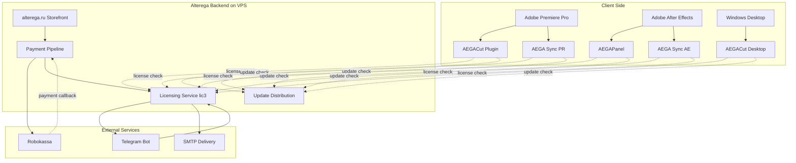

# Alterega - Commercial Plugin Platform for Adobe Premiere Pro and After Effects

Alterega is a commercial ecosystem of video-editing tools for Adobe Premiere Pro and After Effects. The platform comprises three product lines across five builds: AEGACut plugin and desktop, AEGAPanel, AEGA Sync for Premiere Pro, and AEGA Sync for After Effects. It also includes a central licensing service, a payment pipeline, a storefront, and Telegram-based delivery and support. The system has been operated by a single engineer since 2026.

## Live Links

- Website: <https://alterega.ru>
- Telegram: <https://t.me/alterega>
- YouTube: <https://youtube.com/@alteregaedit>

## Product Matrix

| Product | Platform | Build | Status | Description |
|---|---|---|---|---|
| AEGACut | Adobe Premiere Pro | CEP plugin | Production | Speech-heavy timeline cleanup inside Premiere Pro, centered on pauses, filler words, retakes, and controlled apply. |
| AEGACut Desktop | Windows | Standalone Electron app | Production | Desktop cleanup workflow that packages the AEGACut analysis approach outside the Premiere panel runtime. |
| AEGAPanel | Adobe After Effects | CEP plugin | Production | After Effects panel for beat-marker assisted clip placement and timeline automation around compositions. |
| AEGA Sync | Adobe Premiere Pro | CEP plugin | Production | Utility panel for synchronizing source folders into Premiere Pro project bins. |
| AEGA Sync | Adobe After Effects | CEP plugin | Production | Utility panel for synchronizing source folders into After Effects project structure. |

## High-Level Architecture

## Technology Stack

| Area | Verified stack |
|---|---|
| Storefront | Next.js, React, Tailwind, Framer Motion, PostgreSQL, SQLite |
| Licensing backend | Node.js, Fastify, PostgreSQL |
| Database | PostgreSQL plus selected SQLite-backed storefront components |
| Payments | Robokassa integration |
| Telegram bot | Python with python-telegram-bot |
| Plugins for Adobe hosts | Adobe CEP, ExtendScript ES3, JSX, Python sidecars |
| Desktop app | Electron, Python workers, ffmpeg |
| Infrastructure | Linux VPS, Nginx, systemd, UFW, GitHub Actions |
| Email delivery | SMTP |

## Engineering Highlights

- [Single licensing core across product builds](docs/04-licensing.md) with build-specific client identity and access checks.
- [Hardware-bound activation concept](docs/04-licensing.md) with recovery paths and controlled activation handling.
- [CEP hardening posture](docs/08-engineering-decisions.md) for Adobe panels where native protection is limited.
- [Cross-host support](docs/02-products.md) across Premiere Pro, After Effects, and Windows desktop runtimes.
- [Payment-to-delivery pipeline](docs/05-storefront.md) connecting storefront checkout, payment confirmation, license issue, Telegram, and SMTP.
- [Update distribution model](docs/06-distribution.md) that separates optional notices from required update states.
- [Operational VPS layout](docs/07-infrastructure.md) using reverse proxy, managed services, database storage, and host firewall boundaries.

## Repository Scope

This repository is an architectural showcase of a commercial platform in active operation. Source code for the products, licensing backend, payment pipeline, and storefront is not published. The documentation describes architectural principles and engineering decisions without revealing implementation details, anti-tamper mechanisms, or proprietary logic.

## Related

- Knowledge operations: [pai-methodology](https://github.com/egordushenko/pai-methodology) - the typed knowledge-base system that backs this work.

## About the Author

Egor Dushenko is the founder and sole engineer behind Alterega. He builds Adobe workflow tools, licensing infrastructure, storefront systems, delivery automation, and operational knowledge systems. GitHub: [egordushenko](https://github.com/egordushenko). Telegram: [Alterega](https://t.me/alterega).
