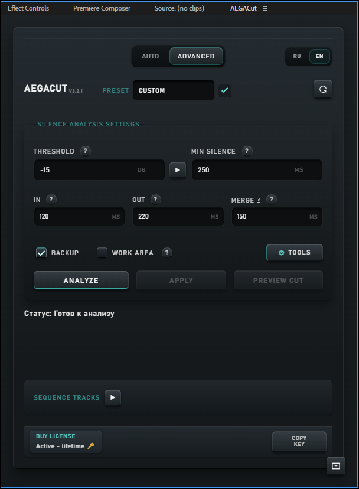
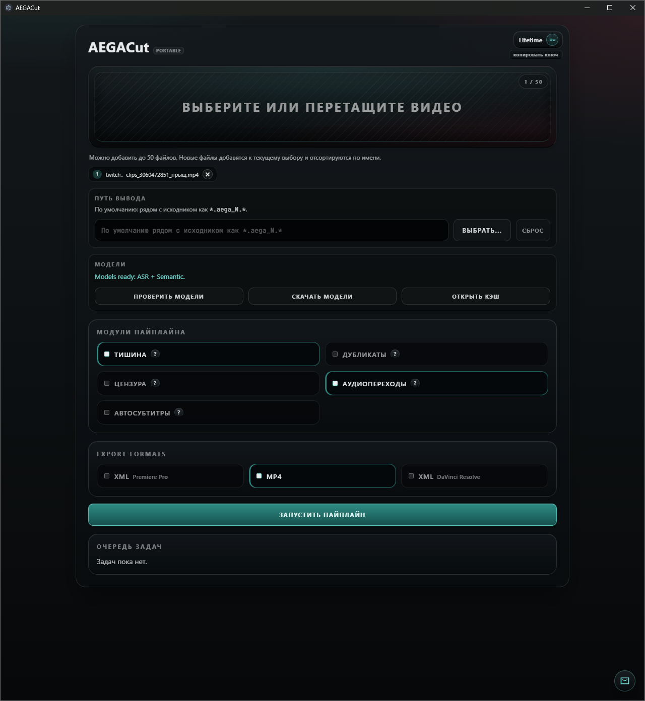
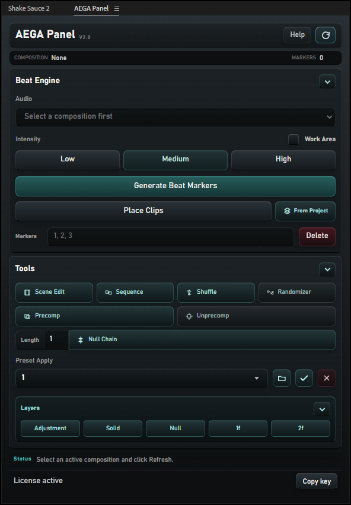
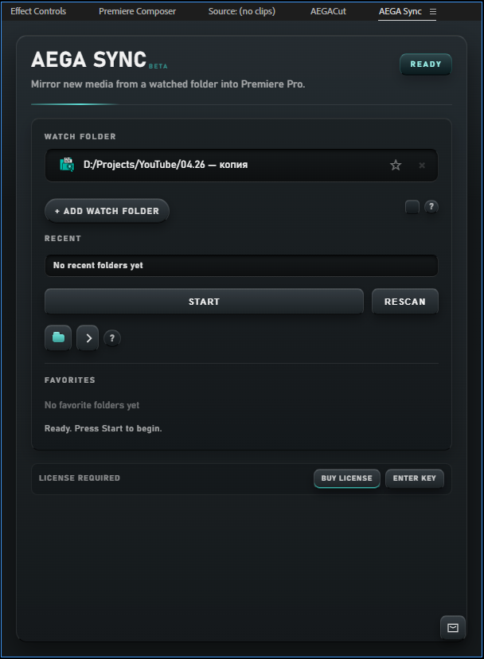
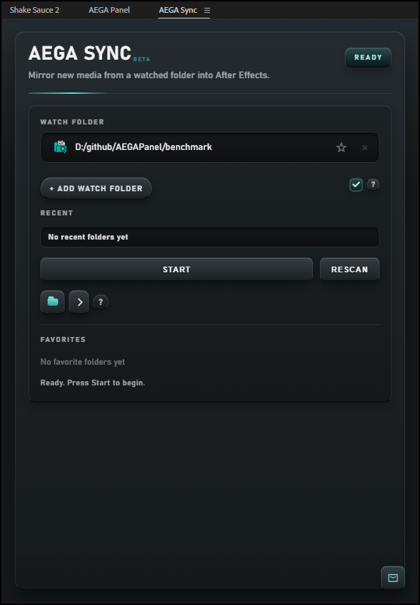

# Product Builds

Alterega currently has three product lines across five product builds. The matrix is intentionally split by runtime because Adobe CEP panels, After Effects panels, and a Windows desktop app have different host boundaries, packaging requirements, and support surfaces.

## AEGACut for Premiere Pro

AEGACut for Premiere Pro is a CEP panel for speech-heavy timeline cleanup. Its core workflow is render, analyze, and apply: Premiere Pro provides the host export, Python-backed analysis prepares structured ranges, and JSX or host-safe operations apply changes back to the timeline. The product is designed around controlled cleanup rather than replacing the editor. Work area, selected clips, backup behavior, and predictable apply modes are part of the product boundary.

Stack: Adobe CEP, ExtendScript ES3, JSX, panel JavaScript, Python sidecar runtime, ffmpeg. The verified manifest uses Premiere Pro as the host and CSXS as the CEP runtime. The release architecture uses packaged panel assets, compiled JSX delivery, and a bundled Python executable for protected functions.

Use case: a creator or editor has long spoken material and wants a clean rough timeline before making creative decisions. Technical notes: the product avoids aggressive removal when the evidence is ambiguous, because preserving user meaning is more important than cutting every possible pause or retake.

## AEGACut Desktop

AEGACut Desktop is a standalone Windows build using Electron and Python workers. It exists for cleanup workflows that do not fit neatly inside the Premiere Pro panel runtime. The repository uses Electron packaging, worker build scripts, release staging, and validation scripts for deterministic render and analysis behavior.

Stack: Electron, Node.js build tooling, Python workers, ffmpeg, packaged Windows output. The desktop app has a separate client type and runtime path from the Premiere plugin. That separation matters for licensing, app data, update handling, and support.

Use case: a user wants the AEGACut cleanup approach in a desktop workflow. Technical notes: the desktop build should not inherit Premiere-only assumptions such as active sequence access, CEP bridge availability, or QE apply behavior.

## AEGAPanel for After Effects

AEGAPanel is an After Effects CEP panel focused on composition timeline assistance. The source repository verifies an After Effects host manifest, CSXS runtime, JSX entrypoint, build scripts, benchmark tooling, and tests. Its product boundary is After Effects only.

Stack: Adobe CEP, ExtendScript ES3, JSX, Node.js build scripts, Python runtime pieces where needed. The local release pipeline includes runtime build, beat executable build, release build, benchmark, and Node test scripts.

Use case: an After Effects user wants faster clip placement and beat-aligned timeline work inside the host application. Technical notes: host context checks are central because After Effects automation depends on active project and composition state.

## AEGA Sync for Premiere Pro

AEGA Sync for Premiere Pro is a compact CEP utility panel for syncing source folders and media into Premiere Pro project structure. The verified manifest targets Premiere Pro and uses the same CEP runtime model as other Adobe panels in the ecosystem.

Stack: Adobe CEP, ExtendScript ES3, JSX, panel JavaScript. The product is intentionally narrow: it helps keep media organization aligned and avoids becoming a general project management system.

Use case: an editor maintains source folders outside Premiere Pro and needs project bins to follow that structure. Technical notes: folder and bin operations should preserve host expectations and avoid surprising project mutations.

## AEGA Sync for After Effects

AEGA Sync for After Effects brings the same sync concept to After Effects. It has its own extension identity and After Effects host manifest rather than sharing the Premiere Pro build artifact. That distinction keeps host-specific automation explicit.

Stack: Adobe CEP, ExtendScript ES3, JSX, panel JavaScript. The verified manifest targets After Effects and uses a compact panel geometry.

Use case: a motion designer keeps source folders outside After Effects and wants project structure to stay aligned. Technical notes: After Effects item and folder handling differs from Premiere Pro bins, so runtime identity and host bridge behavior are kept separate.

## Shared Product Boundaries

All five builds share a common product standard: the tool must fit the user's existing editing workflow. The Premiere Pro builds should feel like Premiere extensions, the After Effects builds should respect project and composition state, and the desktop app should avoid assuming that an Adobe host is present. This is why the product matrix is split by build instead of presenting one generic feature list.

The Adobe builds also share CEP constraints. Panel UI, host bridge calls, and ExtendScript behavior have to work within an older JavaScript environment and host-specific APIs. This affects testing, error handling, and release packaging. A build can look small in the UI while still carrying important runtime complexity under the surface.

The licensing boundary is shared but not identical. AEGACut plugin, AEGACut Desktop, AEGAPanel, AEGA Sync for Premiere Pro, and AEGA Sync for After Effects each need a clear product and client identity. That identity lets the backend apply access, trial, and update rules without mixing host runtimes.

## Screenshot Status

The PNG files in this repository are placeholders for owner-approved screenshots. They exist so internal links and file structure are complete before review. Public publication should replace them with images that reveal the real product state without exposing private user data, local paths, debug panels, or unreleased UI.
