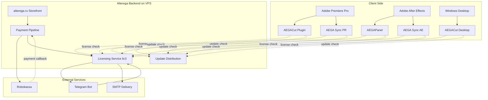
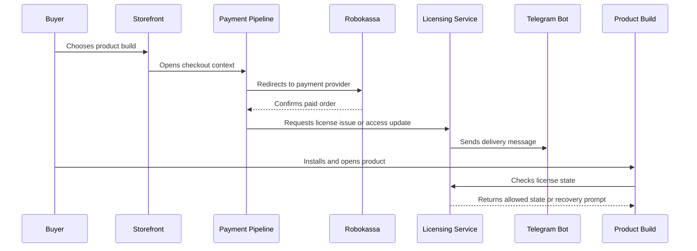

# Architecture

Alterega is organized as product runtimes connected to shared backend services. The product runtimes live close to the editing environment: CEP panels inside Premiere Pro or After Effects, and an Electron desktop app on Windows. The backend services live on a VPS behind a reverse proxy and provide licensing, payment confirmation handling, delivery coordination, and update distribution.

## System Diagram

The diagram intentionally hides implementation details. It shows which components communicate, not exact routes, data models, or internal service names. That boundary matters because the private repositories contain payment handling, licensing behavior, and operational configuration that should not be published.

## Component Responsibilities

The storefront owns product discovery, checkout entry, public download links, and the user-facing purchase path. It is built with Next.js, React, Tailwind, Framer Motion, PostgreSQL, and selected SQLite-backed pieces.

The payment pipeline owns order confirmation and the transition from paid order to product access. Robokassa is the payment provider. The showcase does not publish callback routes, signature material, or retry implementation details.

The licensing service owns product access state. It is implemented with Node.js, Fastify, and PostgreSQL. It verifies whether a build should proceed, whether a trial or paid state is allowed, whether an update is advisory or blocking, and whether recovery is needed.

The Telegram bot owns delivery and support workflows around product access. It is implemented in Python with python-telegram-bot. SMTP is used as a secondary delivery channel where email is appropriate.

The product builds own host-specific behavior. Adobe CEP panels coordinate UI, host calls, and runtime sidecars. AEGACut Desktop owns its own Electron runtime and worker process handling.

## Purchase to Activation

This sequence is intentionally concept-level. It omits exact endpoints, payment signatures, license generation details, activation identifiers, database schema, and anti-tamper behavior. The point is to show the architectural boundary: payment does not directly unlock a product build; it updates access state through the licensing control plane, and products check that state through a controlled client path.

## Data Boundary

The architecture separates public product information from private operational data. Product pages can describe what a build does, but payment confirmation, licensing state, and recovery handling remain server-side. The client receives only the state it needs to continue, warn, block, or ask the user to recover access.

The same boundary applies to diagrams. The diagrams show control flow but do not show route names, provider payloads, database fields, service unit names, or internal hostnames. This is a deliberate review posture: enough structure to evaluate the design, not enough detail to duplicate or attack the system.

## Why the Control Plane Matters

Without a shared control plane, each product build would need to solve payment state, trial state, activation, recovery, and updates separately. That would multiply support cases and make policy drift likely. The licensing service turns those concerns into a central service while allowing each runtime to handle host-specific presentation and failure modes.

The product runtimes remain responsible for local user experience. For example, a required update should be shown in a way that fits a compact CEP panel or a desktop app. The backend can decide that the update is required, but the client must make that decision understandable inside its own interface.
