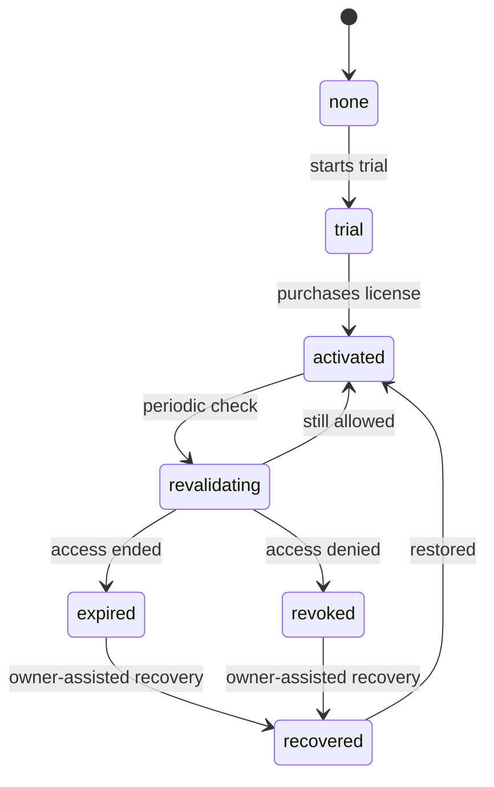

# Licensing Architecture

The licensing service is the deepest technical component in this showcase because it connects payment state, product identity, trial policy, activation state, update policy, and recovery. It is shared by five product builds that run in different environments: Premiere Pro CEP, After Effects CEP, and Windows desktop.

The implementation is private. This document describes principles and boundaries only. It does not publish algorithms, database schema, request routes, signing details, or anti-tamper implementation.

## Threat Model

The products run in client-controlled environments. Adobe CEP panels expose a mixed runtime of panel JavaScript, ExtendScript, host APIs, and local files. Desktop builds run on user machines with their own process model and file system access. A licensing design for this environment must assume that local files can be inspected, modified, or copied.

The main risks are unauthorized reuse of paid access, replay of stale local state, misuse of trial flows, forced use of outdated builds, and accidental support lockout after legitimate hardware or installation changes. The service must also avoid leaking internal policy details through user-facing errors.

## Central Licensing Core

The licensing service is a shared backend rather than one licensing implementation per product. Product builds identify themselves by product and client type. That allows one service to serve AEGACut plugin, AEGACut Desktop, AEGAPanel, AEGA Sync for Premiere Pro, and AEGA Sync for After Effects while keeping client-specific rules separate.

The service is implemented with Node.js, Fastify, and PostgreSQL. The exact schema is omitted. The public architectural point is that product builds do not own the final source of truth for paid access. They ask the licensing control plane for the current state and apply the result according to local runtime rules.

## Offline Validation Principle

Some user workflows cannot assume continuous internet availability. The product design therefore separates the ability to continue a previously allowed session from the need to periodically revalidate server state. Local state may allow a product to remain usable for a bounded period, but server state wins for hard outcomes such as expired access or required updates once the client reconnects.

This is not a disclosure of the validation algorithm. The private implementation decides how local proof is stored, when it expires, how it is signed, and how the client interprets it.

## Hardware-Bound Activation Concept

The platform uses a hardware-bound activation concept to reduce license sharing. The public concept is simple: a license is associated with a device-like identity and controlled activation slots. The private implementation of identity derivation is not published and should not be inferred from this repository.

Recovery is treated as a product requirement, not as an afterthought. Legitimate users can change devices, reinstall software, or hit edge cases. The system therefore needs a recovery path that does not turn anti-abuse into a support dead end.

## Lifecycle

The lifecycle begins with no access, may enter a trial state, then moves to activated state after purchase. Activated clients periodically revalidate. Revalidation can preserve access, move the client toward an expired state, deny access, or require owner-assisted recovery.

## Product-Specific Boundaries

AEGACut plugin and AEGACut Desktop share product intent but not runtime assumptions. They have separate client types because CEP and Electron have different installation, storage, and update surfaces.

AEGAPanel is After Effects only. Its trial and usage model can differ from AEGACut without forcing a separate licensing service.

AEGA Sync has Premiere Pro and After Effects builds. They share a product concept but keep host identity explicit.

## Edge Cases

Common edge cases include stale local cache, interrupted payment confirmation, retry after provider delay, manual reinstall, outdated client version, missing host context, and recovery after device changes. The service should produce stable user outcomes for these cases without exposing internal policy details.

## What Is Omitted

This repository omits license key format, signing approach, hardware identity derivation, request and response schemas, database layout, callback verification details, retry internals, administrative actions, and anti-tamper implementation. Those details are private because publishing them would reduce the protection value of the system and expose operational risk.

## Trial Handling

Trial handling is part of the same access model as paid activation. A trial should give a realistic product experience during its valid period, because a restricted trial can make the user judge the wrong product. At the same time, trial state needs anti-abuse boundaries so repeated resets do not become a replacement for paid access.

The public concept is that trial state is tracked server-side and interpreted by the client as an allowed state while valid. The private details of how a trial is started, counted, refreshed, blocked, or recovered are omitted.

## Update and Access Interaction

Licensing is not only a yes-or-no purchase check. It is also the natural place to return update guidance because the service already knows product identity and client type. Optional update notices can be shown without blocking work. Required updates can block protected actions when an old build is no longer compatible with service policy or release expectations.

This makes server state the final authority for hard states. Local cache can improve resilience, but it should not permanently override expired, revoked, or required-update outcomes after the client reconnects.

## Support and Recovery

The recovery path is a major part of the design. A strict activation system without recovery creates support failure for legitimate users. A loose recovery system weakens access control. The platform balances those concerns by treating recovery as an explicit state in the lifecycle rather than an informal manual override.

Recovery can involve owner review, user guidance, or reset of allowed device state. The exact administrative workflow is private. Publicly, the important architectural point is that recovery is designed into the lifecycle and delivery channels rather than added as a one-off exception.

## Client Runtime Differences

CEP panels and desktop apps do not store or execute code in the same way. A Premiere Pro panel may need to coordinate panel JavaScript, ExtendScript, host exports, and a Python sidecar. An After Effects panel has different host object models. The desktop app has Electron windows and worker processes. Licensing logic therefore cannot assume that every client has the same storage, startup, or error-reporting path.

Product and client identity solve part of that problem. The backend can issue a decision for a specific build type, and the client can translate that decision into runtime-appropriate behavior.
