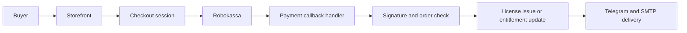

# Storefront and Payment Flow

The Alterega storefront is the public entry point for product discovery, trial entry, downloads, and checkout. The verified local repository uses Next.js, React, Tailwind, Framer Motion, PostgreSQL, SQLite-backed components, nodemailer, and PostgreSQL client libraries.

The storefront does not own final product access by itself. Its role is to start the checkout context and guide the buyer toward payment and delivery. Access state is finalized through the payment pipeline and the licensing service.

## Payment Webhook Flow

The payment provider is Robokassa. The public architecture is provider confirmation, server-side verification, license issue or access update, and delivery through Telegram and SMTP. Exact callback routes, signature logic, shop identifiers, retry rules, and operational configuration are intentionally omitted.

## Delivery Channels

Telegram is the primary operational channel for delivery and support. A dedicated bot coordinates user-facing delivery messages and can interact with the licensing service. SMTP provides an additional delivery route where email is the better fit.

This split keeps product builds focused on runtime work. The Adobe panels and desktop app do not need to implement payment flows or manual support workflows. They only need to present access state and recovery prompts in a way that fits their host environment.

## Storefront Scope

The storefront publishes product pages, catalog structure, download entry points, and checkout actions. It also exposes public product positioning, but this showcase does not copy marketing strategy, pricing tables, audience analysis, or private launch planning from the knowledge base.

## Failure Modes

Expected failure modes include canceled payment, provider delay, duplicate callback, delivery channel failure, and user reinstall after purchase. The architecture handles these by separating order confirmation, access state, and delivery. This repository does not document exact idempotency keys or storage details.

## Checkout Boundary

The checkout boundary is intentionally server-centered. The public storefront can guide a user to a purchase, but the final access decision is made only after provider confirmation has been verified server-side. This protects the flow from relying on browser redirects or client-side state.

A completed payment can lead to new license issue, renewal, or entitlement update depending on product and offer rules. This repository does not publish those rules because pricing and offer logic are commercial material.

## Delivery Failure Handling

Delivery can fail even when payment succeeds. A Telegram message can be missed, email can bounce, or a user can reopen the product from a different environment. Separating licensing from delivery means the paid access state can remain correct even if a notification needs to be retried or support needs to assist the user.

The storefront, bot, SMTP path, and product clients all point back to the same access control source. That is the key reliability property of the flow.

## Public Versus Private Product Data

The public website can show product names, trial entry, catalog structure, and download actions. It should not expose private pricing strategy, internal product aliases, payment provider configuration, or support automation internals. This repository follows that boundary by describing flow shape only.
