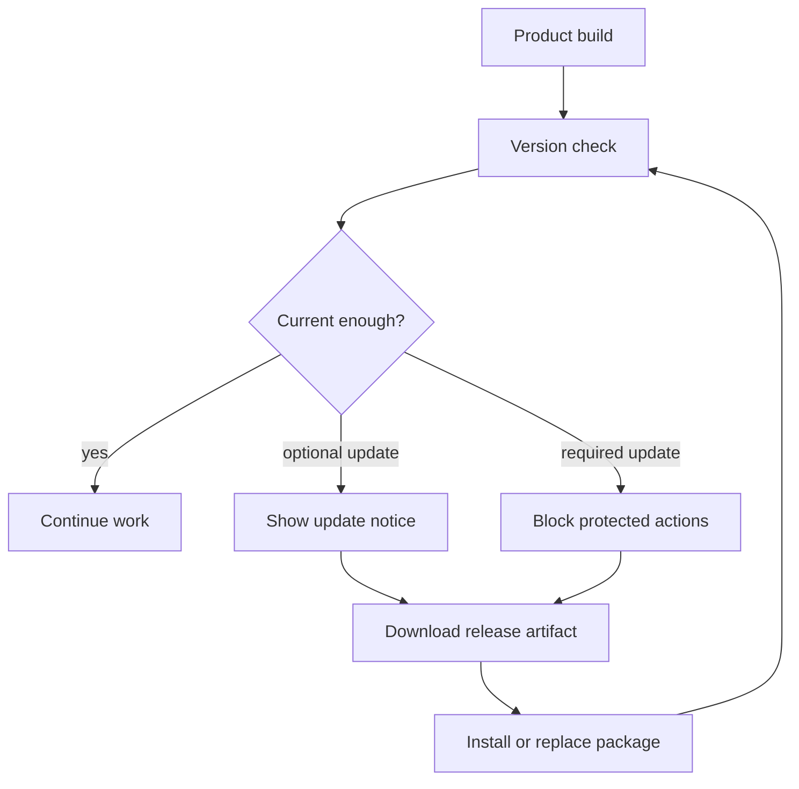

# Distribution and Updates

Alterega distributes multiple runtime shapes: Adobe CEP packages for Premiere Pro and After Effects, a Windows desktop app, and downloadable release artifacts. Distribution is connected to licensing because old builds can be advisory or blocked depending on service-side version policy.

## Update Delivery Flow

The update model distinguishes optional notices from required update states. Optional notices can guide a user toward a newer build without blocking work. Required update states can stop protected actions when the server considers a client too old to continue.

## Download Flow

The storefront presents public download entry points. The final artifact can be an installer, a manual package, or a desktop release depending on product build. This repository does not publish exact artifact URLs beyond public website links, nor does it document private storage layout.

## Versioning Policy

Each product build has its own runtime identity. Adobe CEP manifests carry extension identity and host compatibility. Desktop builds carry Electron package identity and release metadata. The licensing service provides server-side version guidance so local manifests and published artifacts do not become the only source of truth.

## Operational Notes

Distribution must avoid development-only assumptions. A packaged release should not depend on a local source tree, development junction, or unbundled worker runtime. A release is considered review-ready only when the artifact can be installed, opened, and checked against the licensing and update flow.

## Artifact Classes

The platform distributes different artifact classes: CEP extension packages, manual installation archives, Windows desktop builds, and public download links. Each class has different user expectations. A manual CEP package must preserve the expected extension structure. A desktop build must include the runtime pieces it needs. A public download link must point to the current reviewed artifact.

## Review Before Publication

Before a release is made public, the artifact should be checked independently from the source tree. This matters because local development layouts can hide missing bundled files, stale manifests, or paths that exist only on the developer machine. The public artifact is the real delivery surface.

Update policy should also be checked at the same time. A new release is incomplete if the client artifact, public download entry, and service-side update guidance disagree.
