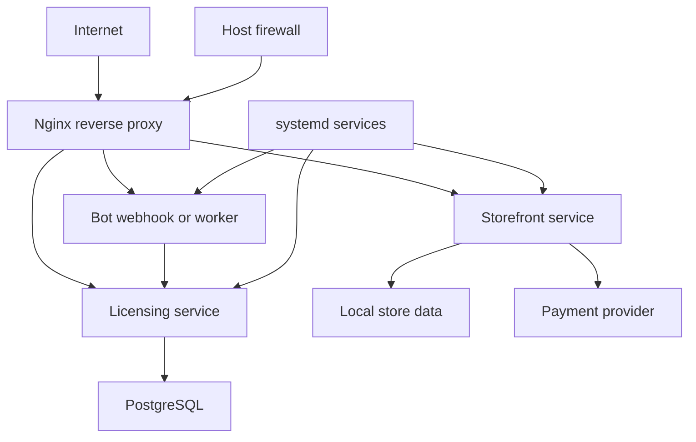

# Infrastructure

Alterega infrastructure is VPS-based. The verified infrastructure repository contains Nginx configuration, systemd service definitions, package setup notes, and deployment material. This showcase keeps the description general and avoids provider names, exact hostnames, IP addresses, ports, service names, database names, or private paths.

## Topology

The reverse proxy is the public ingress point. It routes traffic to application services such as the storefront and licensing backend. Background or webhook-driven workers handle bot and delivery behavior. The database layer supports licensing and selected storefront state. A host firewall limits the exposed surface.

## Services

System services keep the storefront, licensing backend, and bot processes running after reboot and across deploys. The service manager also gives a consistent place for logs, restart behavior, and failure inspection. Exact unit names are not published.

## Deployment

The deployment posture is repository-driven and uses GitHub Actions where appropriate. Production changes move through Git rather than manual file copying. This reduces drift between source repositories and the running environment.

## Backups

The backup posture should cover database state and deploy-critical configuration. This showcase documents the class of material to protect, not the exact backup schedule or storage destination. Sensitive operational details are deliberately omitted.

## Monitoring

Monitoring is handled through service health, logs, and operational checks. The goal is practical incident visibility for a solo-operated platform: know when a service is down, when payment or licensing flow is failing, and when disk or process health needs attention.

## Security Posture

The infrastructure posture is based on reducing exposed surface. The reverse proxy is the front door, application services stay behind it, and the host firewall limits direct access. Administrative access, provider credentials, database access, and service configuration are outside the public documentation boundary.

Payment and licensing services are treated as higher-risk than ordinary content routes. They need stricter review around request verification, idempotency, replay behavior, logging, and error disclosure. This repository does not claim that a full security audit has been published; it documents the architectural posture and the private review areas.

## Drift Control

VPS systems often drift when fixes are applied manually under time pressure. The repository-driven deployment model reduces that risk. Service definitions, reverse proxy configuration, and setup notes are kept under version control where practical. Manual production changes should be backported into source material or they become hidden state.

## Operational Checks

Useful checks include service health, reverse proxy configuration validation, database availability, disk capacity, and recent error logs. The exact commands and service names are private, but the categories matter: a solo-operated platform needs fast read-only diagnosis before making changes.

## Backup Classes

Backups should be thought of by class. Database-backed access state has a different recovery value from deploy configuration, public static assets, logs, or temporary build output. The public documentation names the classes so the operating model is understandable, while exact retention, destination, and restore commands stay private.
